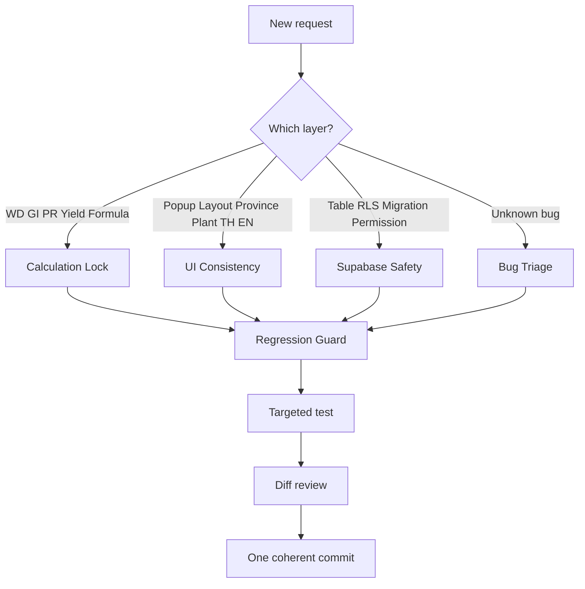
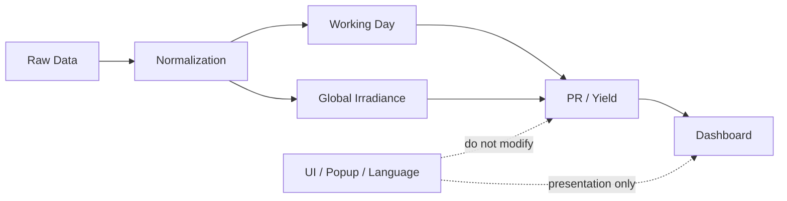

# Summary WD & GI Workflow Note

## Skill router

## Data and calculation boundary

## Database safety path

## Short operating note
Treat formulas as locked unless the request explicitly changes them. For visual changes, stay in the UI layer. For Supabase work, prefer additive migrations and preserve RLS. When a bug is vague, classify its layer before opening large files.
